# SignalCD Modern PoC

**An independent modern proof-of-concept implementation of SignalCD, the system described in _End-to-End Encrypted Collaborative Documents_ (USENIX Security 2026).**

This repository is a browser-first reimplementation and extension of the SignalCD research construction. It preserves the paper's core idea—strongly convergent client-side reconciliation over an end-to-end encrypted asynchronous broadcast channel—while adding a modern TypeScript client stack, durable local-first storage, authenticated collaboration state, a `signal-cli` sidecar, and an Android compatibility scaffold.

It is **not** an official Signal product and is not affiliated with Signal Messenger LLC, the Signal Foundation, EPFL, the Max Planck institutes, or the paper authors.

## Project identity

| Item | Value |
| --- | --- |
| Project name | **SignalCD Modern PoC** |
| Repository | `fkr-0/signalcd-modern-poc` |
| Documentation | <https://signalcd-poc.fkr.dev/> |
| Current release line | `0.0.3` technical preview |
| Research system | **SignalCD** |
| Paper | Christian Knabenhans, Zayd Maradni, Carmela Troncoso, _End-to-End Encrypted Collaborative Documents_, USENIX Security 2026 |
| Upstream research prototype | <https://github.com/spring-epfl/signal-collaborative-documents> |

The original internal namespace remains visible in compatibility-sensitive identifiers such as `@e2e-col/*`, `E2E_COL_*`, `e2e-col:v1:`, Android `dev.e2ecol.*`, and existing local-storage/deep-link identifiers. Those names are retained deliberately in the `0.x` line to avoid silently changing protocol, persistence, import, and deep-link contracts during a documentation/release rename.

## What works today

| Surface | State |
| --- | --- |
| Browser local-first collaborative text | Implemented and extensively tested |
| Automerge convergence under delay/reorder/duplication/offline delivery | Implemented |
| Durable IndexedDB state + outbound replay | Implemented |
| Browser-owned Ed25519/X25519 application identity + recipient-bound E2EE | Implemented in the current test/toy environment |
| Authenticated R6 collaboration authorization/fork handling | Implemented in the current trust model |
| `signal-cli` sidecar adapter | Implemented and contract-tested |
| Real two-account Signal collaboration | **Still requires live external qualification** |
| Android sidecar proxy | Implemented |
| Android editing the shared encrypted document | **Not yet wired**; native E2EE/Keystore parity remains a gate |
| Production identity provisioning / authenticated first-contact deployment | Incomplete |

The detailed state table, architecture diagrams, security boundaries, artifact links, and roadmap are on the [documentation landing page](docs/index.md).

**Help wanted:** the highest-value external contribution is a two-account run against current real `signal-cli`. Follow [`docs/SIGNALCLI-EXPERIMENT.md`](docs/SIGNALCLI-EXPERIMENT.md) and report only sanitized evidence.

## Architecture at a glance

```mermaid
flowchart LR
  A[Browser / client replica] -->|Automerge + ProtocolEnvelope| B[Application E2EE]
  B -->|opaque binary frames| C[Local sidecar]
  C -->|JSON-RPC + SSE| D[signal-cli]
  D -->|Signal group messages| E[Signal network]
  E --> D2[peer signal-cli]
  D2 --> C2[peer sidecar]
  C2 --> B2[peer application E2EE]
  B2 --> A2[peer replica]
```



The sidecar is a transport boundary, not a plaintext merge authority. Browser private application keys remain client-owned; Signal device credentials remain outside browser storage.

## Getting started

```bash
git clone --recurse-submodules https://github.com/fkr-0/signalcd-modern-poc.git
cd signalcd-modern-poc
pnpm install --frozen-lockfile
pnpm run check
pnpm dev
```

For the real `signal-cli` bring-up path and its current external prerequisites, see [`docs/LIVE-TUTORIAL.md`](docs/LIVE-TUTORIAL.md). For Android, see [`docs/android-integration.md`](docs/android-integration.md).

## Releases and artifacts

GitHub Releases publishes the technical-preview artifacts produced by CI:

- static browser build archive;
- Android **debug** APK for the current compatibility scaffold;
- sidecar/protocol source bundle for the companion transport boundary;
- SHA-256 checksums.

See **<https://github.com/fkr-0/signalcd-modern-poc/releases/latest>**.

## Research provenance

The generic E2EE-CD framework in the paper combines an end-to-end encrypted asynchronous broadcast primitive with a reconciliation mechanism that guarantees globally consistent document views. The authors instantiate that framework as **SignalCD** using Signal group messaging and provide an Automerge/Signal research prototype. This repository keeps that provenance explicit and preserves the reviewed upstream code as the `upstream/` submodule.

Primary references:

- USENIX Security 2026 paper page: <https://www.usenix.org/conference/usenixsecurity26/presentation/knabenhans>
- SPRING/EPFL prototype: <https://github.com/spring-epfl/signal-collaborative-documents>
- [`docs/POC-REVIEW.md`](docs/POC-REVIEW.md)
- [`docs/ARCHITECTURE.md`](docs/ARCHITECTURE.md)
- [`docs/ROADMAP.md`](docs/ROADMAP.md)
- [`docs/TARGET-API-SPEC.md`](docs/TARGET-API-SPEC.md)

## License

MIT. Research citations and third-party trademarks remain the property of their respective owners.
