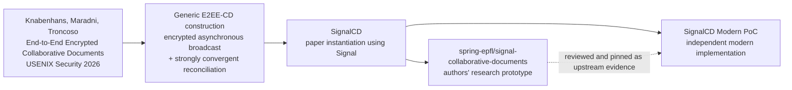

# Research provenance: paper, SignalCD, authors' PoC, and this repository

## Purpose

This document makes the relationship between the research work and **SignalCD Modern PoC** explicit. It is intended to prevent two opposite mistakes: hiding the research lineage, or implying that this repository is the paper authors' official implementation.

## Canonical relationship



## What comes from the paper

The paper provides the architectural construction and security/correctness requirements that motivate this repository: client-side strongly convergent reconciliation combined with an end-to-end encrypted asynchronous broadcast channel, plus document-sharing, lifecycle, confidentiality, integrity, and participant-list requirements.

The project tracks these requirements as R1–R10 in `docs/POC-REVIEW.md` and uses them as design and test targets. The paper is a **design/provenance source**, not code copied into the modern implementation.

## What comes from SignalCD

**SignalCD** is the paper's Signal-backed instantiation of the generic construction. It demonstrates that Signal group messaging can carry collaborative-document updates while a client-side reconciliation layer converges document state.

This repository keeps the SignalCD name visible because that is the most accurate description of the concrete research lineage being explored. The public project name adds **Modern PoC** to distinguish this work from the paper authors' system and from any official Signal product.

## What comes from the authors' prototype

The authors' prototype is preserved as a pinned Git submodule:

```text
upstream/
  https://github.com/spring-epfl/signal-collaborative-documents
  pinned commit: 2b96245a484ad651b74afead945478c40084728f
```

The prototype is used as implementation evidence for:

- Automerge incremental updates;
- Signal group-message transport;
- asynchronous/concurrent-edit benchmark scenarios;
- the feasibility of composing reconciliation with Signal delivery.

It is **not** treated as the application codebase. SignalCD Modern PoC has its own client, protocol, persistence, identity, authorization, sidecar, web UI, tests, and Android work.

## What is original to this repository

| Area | SignalCD Modern PoC contribution |
| --- | --- |
| Browser architecture | Vite/React client with a framework-neutral collaboration client layer |
| Protocol | Versioned binary envelopes, validation, chunking, deduplication and recovery semantics |
| Local-first durability | IndexedDB persistence, durable outbound replay, checkpoints, restart behavior |
| Application identity/E2EE | Browser-owned Ed25519/X25519 identity and recipient-bound encrypted envelopes |
| Authorization | Signed authorization roots/history, replay resistance, fork detection/resolution |
| Sidecar boundary | Hardened localhost WebSocket ↔ `signal-cli` JSON-RPC/SSE adapter |
| Fault evidence | Deterministic delay/reorder/duplicate/drop/offline transport testing |
| Android | Kotlin protocol/storage/session/sidecar compatibility scaffold and tests |
| Operator/research UX | Inspector/guided views, status and recovery evidence |

## Naming and compatibility

The public project name is **SignalCD Modern PoC** and the GitHub repository is `signalcd-modern-poc`.

Compatibility-sensitive identifiers from the earlier implementation name remain unchanged in the `0.x` line:

- package scope `@e2e-col/*`;
- environment variables `E2E_COL_*`;
- Signal message namespace `e2e-col:v1:`;
- IndexedDB/localStorage names;
- Android Java/Kotlin namespace `dev.e2ecol.*`;
- existing `e2e-col://` deep links.

Changing those is a protocol/storage/API migration and is intentionally separate from the public-facing rename.

## Affiliation statement

SignalCD Modern PoC is an **independent research/development project**. It does not claim authorship of the paper, ownership of the authors' prototype, or affiliation with Signal Messenger LLC, the Signal Foundation, EPFL, the Max Planck institutes, or the named paper authors.

Use of “SignalCD” identifies the research construction being implemented and evaluated. “Signal” and other third-party marks remain the property of their respective owners.

## References

1. Christian Knabenhans, Zayd Maradni, Carmela Troncoso, **End-to-End Encrypted Collaborative Documents**, 35th USENIX Security Symposium, 2026. <https://www.usenix.org/conference/usenixsecurity26/presentation/knabenhans>
2. SPRING/EPFL, **signal-collaborative-documents** research prototype. <https://github.com/spring-epfl/signal-collaborative-documents>
3. Local implementation review: [`POC-REVIEW.md`](POC-REVIEW.md)
4. Architecture: [`ARCHITECTURE.md`](ARCHITECTURE.md)
5. Requirements/roadmap: [`ROADMAP.md`](ROADMAP.md)
