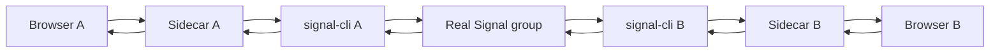

# Real `signal-cli` validation experiment

## Goal

Produce the missing external evidence for the Signal transport claim: **two independently provisioned Signal accounts exchange one SignalCD Modern PoC document through current `signal-cli`, with convergence and restart/replay evidence in both directions.**

This is deliberately an experiment protocol rather than an automated account-provisioning script. The repository must not register, link, mutate groups, or handle real Signal credentials without the operator doing those steps explicitly.

## What this experiment proves

| Question | Evidence required |
| --- | --- |
| Does the production sidecar work against current `signal-cli`? | Both sidecars pass health/group startup checks and exchange frames through the daemon HTTP/SSE API. |
| Does Signal really carry the collaborative traffic? | Two different Signal accounts/devices observe cross-device document updates through a shared Signal group. |
| Does application E2EE still work over real Signal delivery? | Remote document convergence occurs with recipient-bound application ciphertext; no plaintext document is required by the sidecar. |
| Does restart/replay work? | One participant queues an edit while disconnected/restarted, reconnects, replays, and both replicas converge. |
| Does duplicate/reordered delivery remain safe? | If naturally observed or reproducibly injected outside Signal, replicas still converge without double-applying state. |

## What it does not prove by itself

- formal security of Signal, Automerge, WebCrypto, or the application protocol;
- production identity-directory/freshness semantics;
- Android native E2EE parity;
- long-term Ed25519 identity-key rebind;
- performance at large participant/document scale.

## Required topology



Use two independent Signal accounts/devices. The cleanest qualification uses two machines or VMs so linked-device state, browser identity state, and sidecar processes are physically separated.

## Prerequisites

- current repository checkout at the release candidate revision;
- Node.js/pnpm versions accepted by the repository;
- current `signal-cli` release supported by the sidecar contract;
- two separately provisioned Signal accounts/devices;
- one Signal group containing both participants;
- group ID exported in the form returned/accepted by `signal-cli`;
- one UUID chosen for the collaborative document;
- browser profiles that do not share IndexedDB/application identity state.

Do not put real phone numbers, Signal data directories, tokens, private keys, or group secrets into GitHub issues or committed logs.

## Record before testing

Capture a sanitized experiment header:

```yaml
experiment:
  project_version: 0.0.3
  git_revision: <commit SHA>
  date_utc: <timestamp>
  signal_cli_version: <exact version>
  java_version: <exact version>
  os_a: <OS/version>
  os_b: <OS/version>
  browser_a: <browser/version>
  browser_b: <browser/version>
  account_a: redacted
  account_b: redacted
  signal_group: redacted
  document_uuid: <UUID is safe unless you prefer to redact it>
```

## Step 1 — prove each `signal-cli` daemon works independently

For each machine, start the daemon according to the current `signal-cli` manual and keep its HTTP API bound to localhost. Then verify:

1. `GET /api/v1/check` returns success;
2. JSON-RPC `listAccounts` sees the intended local account;
3. JSON-RPC `listGroups` sees the shared collaboration group;
4. an SSE connection to `/api/v1/events` remains open;
5. an ordinary Signal text message can be sent A→B and B→A before involving the project.

If any of these fail, classify the run as **Signal/daemon setup failure**, not a project failure.

## Step 2 — start the production sidecars

On machine A:

```bash
export SIGNAL_CLI_HTTP_URL=http://127.0.0.1:8080
export SIGNAL_CLI_ACCOUNT='<account A>'
export E2E_COL_DOCUMENT_GROUPS='{"11111111-1111-4111-8111-111111111111":"<real group id>"}'
export E2E_COL_SIDECAR_PORT=43127
pnpm --filter @e2e-col/sidecar dev
```

On machine B, use its own `SIGNAL_CLI_ACCOUNT`, the same document/group mapping, and a local sidecar port.

Expected startup evidence:

- health check succeeds;
- configured account is accepted;
- configured group is visible/active;
- sidecar binds only to the intended local interface;
- no browser/private application keys appear in sidecar logs.

## Step 3 — open two independent browser clients

Start the web client on each machine with its local sidecar endpoint. Create independent browser-owned identities. Use the same document UUID/group binding for the collaborative session.

Expected state on both clients:

```text
ready · online
Encrypted sidecar/Signal-backed group
```

Exact labels may evolve; record the actual release-candidate UI state.

## Step 4 — bidirectional convergence

1. A writes a unique marker such as `real-signal-A-<timestamp>`.
2. B must converge to exactly that text.
3. B appends `real-signal-B-<timestamp>`.
4. A must converge to exactly the combined text.
5. Confirm both document replicas and authorization heads are equal.

Record:

```yaml
bidirectional_convergence:
  a_to_b: pass|fail
  b_to_a: pass|fail
  final_text_hash_a: <sha256 of plaintext locally>
  final_text_hash_b: <sha256 of plaintext locally>
  equal: true|false
```

Do not publish the document plaintext if it contains real/private content; use synthetic test text.

## Step 5 — restart and durable replay

1. Put B in manual/offline mode or stop its sidecar/daemon after the browser has a durable local session.
2. Make one local edit on B and verify it is shown as queued locally.
3. Close/reopen the browser or restart the sidecar/daemon.
4. Restore the same browser profile.
5. Reconnect and allow durable replay.
6. Verify A receives the queued edit and both replicas converge.

Record whether replay state is reported truthfully. A transport send is not by itself a remote acknowledgement.

## Step 6 — recovery-path observation

Ordinary disconnects must not fabricate a history-loss proof. Verify:

- routine daemon/SSE/WebSocket interruption results in offline/replay behavior;
- recovery/checkpoint publication occurs only if explicit history-risk evidence is raised;
- no generic disconnect is treated as proof of missing CRDT history.

## Step 7 — collect sanitized evidence

Recommended evidence bundle:

```text
experiment-result/
├── result.yml                 # pass/fail matrix + versions
├── browser-a.png              # synthetic document only
├── browser-b.png              # synthetic document only
├── sidecar-a.log.redacted     # no phone/group/private material
├── sidecar-b.log.redacted
├── daemon-contract-a.txt      # health/version only
├── daemon-contract-b.txt
└── SHA256SUMS.txt
```

Never publish `signal-cli` data directories or raw credential-bearing environment dumps.

## Success criteria

The run qualifies the real-Signal path only when all are true:

- Signal works independently in both directions before project involvement;
- both production sidecars start against the real daemon and group;
- A→B and B→A collaborative edits converge;
- application authorization state remains valid;
- one restart/offline replay converges;
- no browser private keys or document plaintext are observed in sidecar/daemon diagnostic state beyond what Signal itself must transport as application ciphertext;
- exact versions and sanitized evidence are recorded.

## Failure classification

| Failure | Classify as |
| --- | --- |
| `signal-cli` health/account/group unavailable | Environment / provisioning |
| Normal Signal text cannot A↔B | Signal/account/group setup |
| Sidecar rejects daemon response shape/version | Sidecar compatibility defect |
| Sidecar starts but project frame never reaches peer | Sidecar/Signal integration defect |
| Peer receives frame but decrypt/auth fails | Application identity/E2EE defect |
| Both decrypt but document diverges | CRDT/protocol/client correctness defect |
| Restart loses durable local edit | Persistence/replay defect |

## Help wanted

The most useful external contribution right now is **a sanitized real-`signal-cli` run using two accounts/devices**. If you can provide that environment, please report:

- exact `signal-cli` version;
- OS/JVM/browser versions;
- pass/fail for each experiment step;
- whether JSON-RPC/SSE response shapes differ from the documented compatibility profile;
- redacted sidecar errors if they occur;
- screenshots using synthetic document content only.

Open a GitHub issue in `fkr-0/signalcd-modern-poc` and label it `real-signal-validation` once the repository is public.
