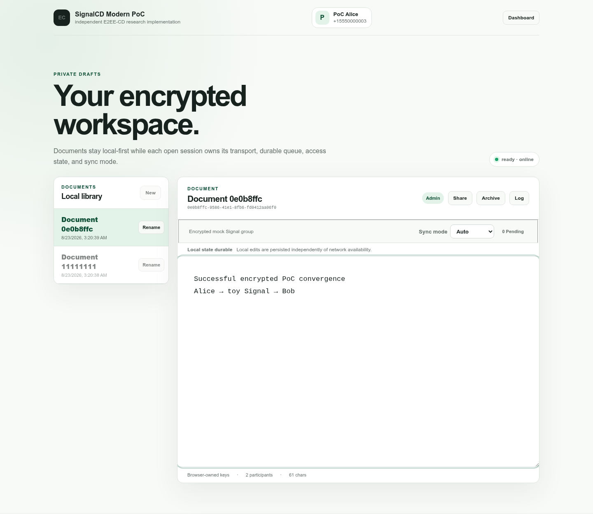
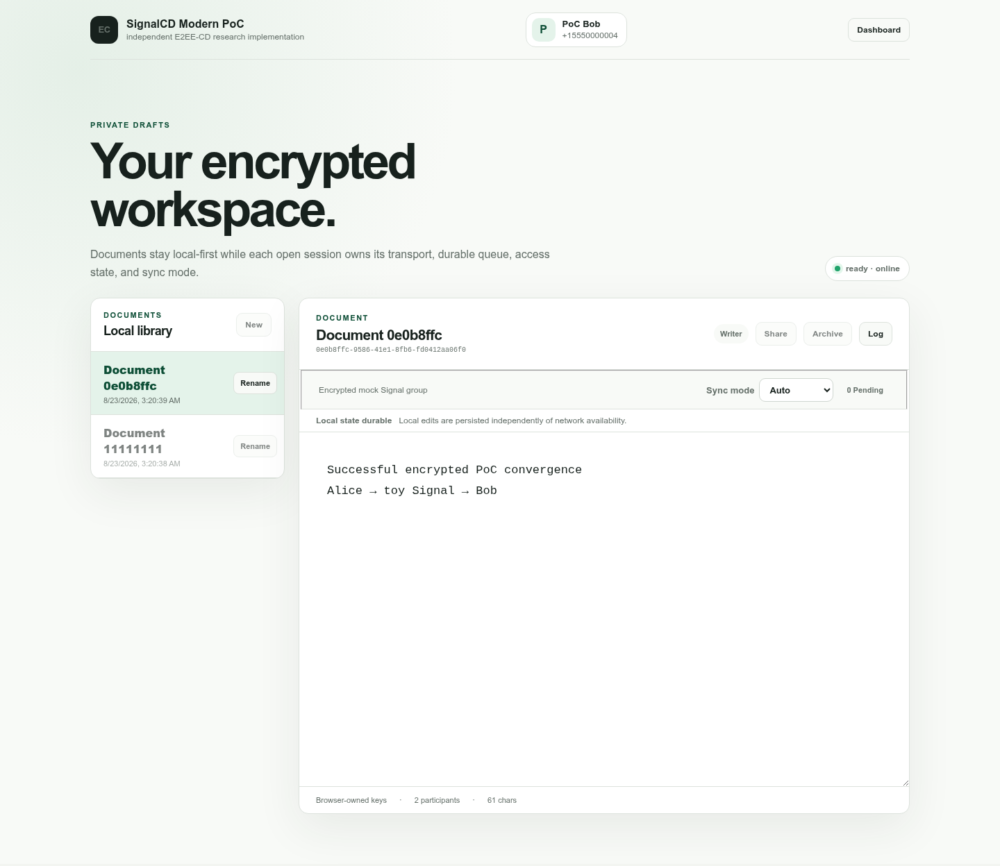
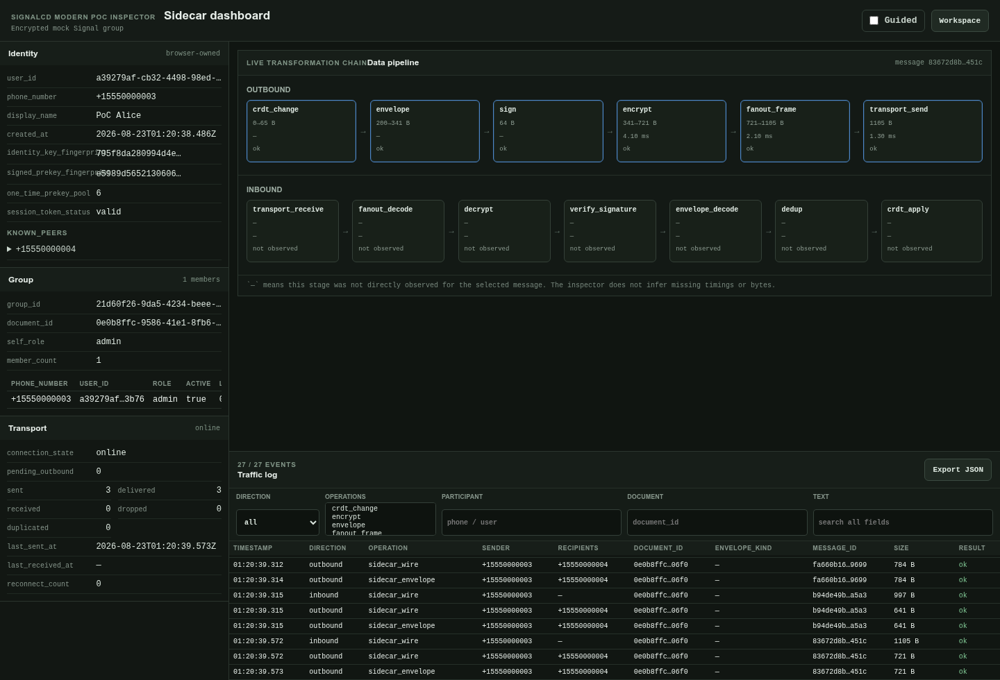
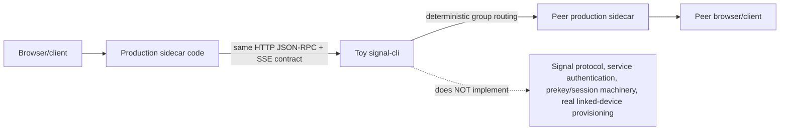
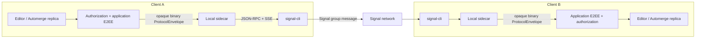
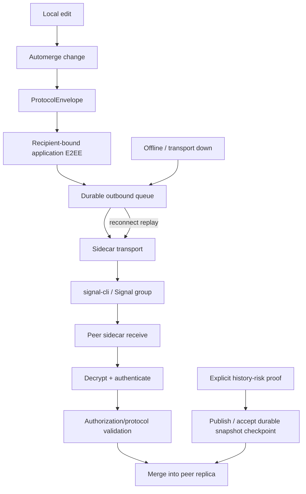
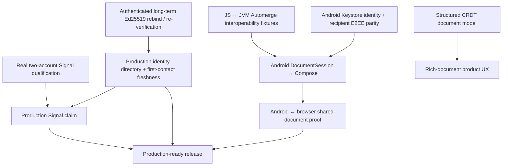
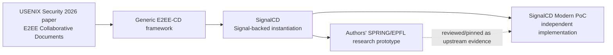

# SignalCD Modern PoC

> Independent modern proof-of-concept implementation of **SignalCD**, the system described in Christian Knabenhans, Zayd Maradni, and Carmela Troncoso, _End-to-End Encrypted Collaborative Documents_ (USENIX Security 2026).

[GitHub repository](https://github.com/fkr-0/signalcd-modern-poc) · [Latest release + artifacts](https://github.com/fkr-0/signalcd-modern-poc/releases/latest) · [API docs](/api/) · [CI](https://github.com/fkr-0/signalcd-modern-poc/actions/workflows/ci.yml) · [Research provenance](RESEARCH-PROVENANCE.md)

## Short state

**Releaseable as a research/developer technical preview, not as a production-secure collaborative editor.** The browser/local-first/E2EE substrate is substantial and tested. The `signal-cli` adapter exists and is contract-tested. A real two-account Signal run is still external release evidence. Android can connect to the project sidecar, but shared-document sends are intentionally gated until native E2EE/Keystore parity exists.

| Area | Short state |
| --- | --- |
| Browser collaboration | **Working** |
| Local-first/offline/replay | **Working** |
| Application E2EE | **Working baseline** |
| Authenticated collaboration state | **Working in current trust model** |
| `signal-cli` sidecar | **Implemented + tested at contract boundary** |
| Live two-account Signal proof | **Not yet qualified** |
| Android sidecar connection | **Working** |
| Android shared-document editing | **Not yet enabled** |
| Production identity/freshness service | **Incomplete** |
| Structured documents | **Future** |

## Next steps / help wanted

The highest-value next proof is **real `signal-cli` validation with two independent Signal accounts/devices**. The repository already has the adapter and an opt-in smoke path; what is missing is external evidence against a current real daemon and real Signal group.

| Priority | Help wanted | Why it matters |
| --- | --- | --- |
| **1** | Run the [real `signal-cli` experiment](SIGNALCLI-EXPERIMENT.md) with two accounts/devices | Converts the strongest remaining transport claim from contract-tested to live-qualified |
| **2** | Report real daemon JSON-RPC/SSE shape differences | Catches compatibility drift that the deterministic toy cannot discover |
| **3** | Validate restart/offline replay over real Signal | Proves durable local-first behavior survives the actual transport boundary |
| **4** | Validate JS↔JVM Automerge/process-restore interoperability and native Android E2EE/Keystore parity | These are the gates before Android may safely operate the same encrypted shared document |
| **5** | Help design authenticated first-contact/freshness and long-term identity-key rebind | Required before a production identity-deployment claim |

**Experiment protocol:** [docs/SIGNALCLI-EXPERIMENT.md](SIGNALCLI-EXPERIMENT.md) gives the topology, prerequisites, commands, evidence bundle, success criteria, and failure classification. Please use synthetic document text and publish only redacted evidence. [Open the dedicated validation report template](https://github.com/fkr-0/signalcd-modern-poc/issues/new?template=real-signal-validation.yml).

## PoC evidence: successful browser E2E

These screenshots were captured by `pnpm run docs:screenshots` after the script created two isolated browser identities, created a collaborative document/group, invited the second participant, sent recipient-bound encrypted application traffic through the toy Signal backend, and asserted that the second replica converged to the same text.

| Alice / sender | Bob / recipient |
| --- | --- |
|  |  |



**Important:** these are **deterministic PoC/test-backend screenshots**, not evidence of a real Signal-network run. The full Chromium+Firefox E2E suite separately passes 14/14, while the real-Signal smoke remains opt-in and unqualified without external accounts.

## What the toy `signal-cli` backend actually mocks

`@e2e-col/toy-signal-cli` is a localhost-only deterministic test double for the **local `signal-cli daemon --http` process boundary**. It mirrors the project compatibility profile for HTTP health checks, JSON-RPC commands, SSE receive notifications, account routing, group fan-out, sender sync echoes, retries, reconnects, chunking, deduplication, and deterministic fault injection.



| Toy proves | Toy does **not** prove |
| --- | --- |
| Sidecar request/response framing against an executable daemon boundary | Real Signal service/account behavior |
| JSON-RPC method/error handling in the supported compatibility profile | Signal protocol cryptography or service authentication |
| SSE receive and sender-sync semantics | Current linked-device provisioning behavior |
| Chunk/reassembly/dedup/retry/reconnect behavior | Real network timing, rate limits, or account restrictions |
| Deterministic duplicate/drop/delay/failure scenarios | Compatibility drift outside the modeled profile |
| Browser application E2EE remains end-to-end through the test transport | Production identity/freshness deployment semantics |

The toy deliberately returns JSON-RPC `-32601` for unsupported methods instead of pretending every Signal feature succeeds. See [`apps/toy-signal-cli/README.md`](https://github.com/fkr-0/signalcd-modern-poc/blob/main/apps/toy-signal-cli/README.md) and [the real experiment protocol](SIGNALCLI-EXPERIMENT.md).

## Diagram of how it works



| Boundary | Owns | Must not own |
| --- | --- | --- |
| Browser/client | Plaintext replica, Automerge state, application identity/private keys, authorization state | Signal linked-device credentials |
| Sidecar | Narrow transport bridge, Signal group/document mapping, retry/chunk/reassembly transport state | Authoritative plaintext document or browser private application keys |
| `signal-cli` | Signal account/device state and Signal transport | CRDT merge authority |
| Signal network | E2EE group-message delivery substrate | Application plaintext document state |

## Done / not done

| Capability | Done? | Evidence / remaining gate |
| --- | --- | --- |
| Automerge text collaboration | **Yes** | Core/client tests and browser integration |
| Delay/reorder/duplicate convergence | **Yes** | Deterministic transport scenarios |
| Offline local edits + durable replay | **Yes** | IndexedDB queues, restart/replay coverage |
| Browser-owned Ed25519/X25519 identity | **Yes, baseline** | Non-exportable private material in browser identity storage |
| Recipient-bound application E2EE | **Yes, baseline** | Toy/integration encrypted-envelope flows |
| Signed R6 authorization history/fork handling | **Yes, current trust model** | Adversarial protocol/client/storage coverage |
| Local WebSocket sidecar | **Yes** | Binary frames, lifecycle/recovery tests |
| `signal-cli` JSON-RPC/SSE backend | **Yes, contract-tested** | Current adapter + opt-in real-Signal smoke test |
| Real two-account Signal collaboration | **No** | Needs provisioned accounts/group and live E2E qualification |
| Android sidecar proxy | **Yes** | Kotlin endpoint/transport tests |
| Android edits shared encrypted document | **No** | Native CRDT interop + Keystore/E2EE parity first |
| Production identity directory / first-contact freshness | **No** | Deployment design remains incomplete |
| Long-term Ed25519 identity-key rebind | **No** | Needs authenticated re-verification preserving existing authorization commitments |
| Structured/rich document model | **No** | Later roadmap item |

## FAQ

### Could we release the project?

**Yes, as a technical preview.** Version `0.0.4` should be described as an experimental/research release with reproducible browser, Android-debug, sidecar-source, and API-doc artifacts. It adds the separately bounded PeerJS browser transport proof, but should not claim production security, Signal-equivalent all-peers-offline durability, or completed live Signal qualification.

### Would it run with `signal-cli`?

**The sidecar is designed and implemented for it.** It speaks the `signal-cli` HTTP JSON-RPC/SSE boundary, performs framing/chunking/reassembly/dedup/retry and group/document mapping, and has contract tests. What is still missing is the final live two-account proof through real Signal infrastructure.

### Would it provide value now?

**Yes.** It is already useful as a reference implementation and research/development platform for local-first E2EE collaboration, authorization under reordered asynchronous delivery, Signal-backed sidecar architecture, deterministic network testing, and browser-owned application identity.

### Can the Android app point directly at `signal-cli`?

**No.** Android speaks the project's sidecar WebSocket protocol, not `signal-cli` JSON-RPC/SSE. The intended chain is Android → project sidecar → `signal-cli`.

### Can the Android app point at the sidecar?

**Yes.** The Phase-1 proxy supports loopback `ws://` and explicitly opted-in remote `wss://` endpoints, binary frames, truthful connection state, and the same history-risk recovery signal as the browser transport.

### Can Android already operate the shared document?

**Not safely yet.** A native `DocumentSession` exists, but Compose is not wired to production collaborative sends because the native recipient-bound E2EE/identity/Keystore layer is not yet equivalent to the browser path. Wiring raw CRDT envelopes now would violate the project's security boundary.

### Why not just put Signal credentials in the browser or Android document layer?

Because the architecture separates **application plaintext/keys** from **Signal linked-device credentials**. Signal transport is kept behind the sidecar; the collaborative-document client owns reconciliation and application-level identity/E2EE.

### Is this the paper authors' project?

**No.** This is an independent modern implementation. The paper and the authors' `spring-epfl/signal-collaborative-documents` repository are explicit provenance sources. See [Research provenance](RESEARCH-PROVENANCE.md).

### Why call it SignalCD Modern PoC?

Because **SignalCD** is the paper's concrete Signal-backed instantiation, and hiding that name would obscure the project's origin. **Modern PoC** distinguishes this implementation from the authors' prototype and avoids presenting it as an official Signal product.

### Why do package names still say `@e2e-col/*`?

Those names are compatibility-sensitive. The `0.x` line intentionally retains package imports, `E2E_COL_*` environment names, `e2e-col:v1:` wire namespace, storage keys, Android namespace, and deep links. Changing them is a separate migration, not a cosmetic rename.

### Do we have generated API documentation?

**Yes, starting with 0.0.3.** `pnpm run api:docs` generates TypeDoc from the public `client`, `core`, `identity`, `protocol`, `storage`, and `transport` package entry points. CI publishes it under [`/api/`](/api/) and as part of the documentation artifact.

### Is there one document that explains the paper, SignalCD, the authors' PoC, and this repository?

**Yes.** [Research provenance](RESEARCH-PROVENANCE.md) is the canonical relationship/attribution document.

## Workflows that are implemented



| Implemented workflow | State |
| --- | --- |
| Create/open local document | Browser client baseline present |
| Local edit → CRDT change → durable persistence | Present |
| Encrypt per recipient → queue → transport send | Present in browser integration path |
| Receive → decrypt/authenticate → validate → merge | Present |
| Offline queue + reconnect replay | Present |
| Duplicate/reordered message handling | Present |
| Signed authorization change history | Present |
| Authorization fork freeze/resolution proof | Present under current trust model |
| Explicit history-risk checkpoint recovery | Present |
| Sidecar WebSocket → `signal-cli` JSON-RPC/SSE mapping | Present |
| Android sidecar connection lifecycle | Present |

## Workflows that are not complete



| Missing workflow | What must happen first |
| --- | --- |
| Real Signal two-user edit/restart/convergence | Provision two accounts/devices, group, run the opt-in live fixture, record exact daemon/version evidence |
| Production identity bootstrap/freshness | Replace toy/provider assumptions with authenticated discovery/pinning/transparency semantics |
| Long-term identity-key change | Design authenticated rebind/re-verification that preserves R6/historical signatures |
| Android shared edit | Prove JS↔JVM Automerge compatibility + process restore, then native E2EE/Keystore parity |
| Android ↔ browser real Signal collaboration | Android shared-edit workflow + live Signal qualification |
| Rich/structured documents | Define and validate a structured CRDT model without weakening current correctness/security gates |
| Production release claim | Complete external Signal, identity-deployment, Android/product hardening and security review |

## API documentation

The public TypeScript package surface is generated with TypeDoc:

```bash
pnpm run api:docs
```

TypeDoc `0.28.20` does not yet support this repository's TypeScript `7.0.2`, so the documentation command invokes a pinned TypeScript `5.9.3` parser and enables TypeDoc's `skipErrorChecking`. This affects documentation reflection only; `pnpm run check` still performs the authoritative TS7 typecheck before CI/release publication.

Generated entry points:

| Package | API |
| --- | --- |
| `@e2e-col/client` | `CollaborativeClient`, `DocumentSession`, public client/session types |
| `@e2e-col/core` | CRDT document/change/edit primitives |
| `@e2e-col/identity` | identity, prekeys, encryption, provider/storage/sync-log types |
| `@e2e-col/protocol` | wire types/codecs, authorization, chunking/dedup, encrypted-envelope primitives |
| `@e2e-col/storage` | durable memory/IndexedDB storage interfaces |
| `@e2e-col/transport` | transport contracts, deterministic network, mock Signal, WebSocket transport |

Published API reference: **<https://signalcd-poc.fkr.dev/api/>**

## Release artifacts

GitHub Releases publishes the technical-preview outputs on each `v*` tag:

| Artifact | Purpose |
| --- | --- |
| `signalcd-modern-poc-web-<tag>.tar.gz` | Static browser build |
| `signalcd-modern-poc-android-debug-<tag>.apk` | Android compatibility/debug scaffold |
| `signalcd-modern-poc-sidecar-source-<tag>.tar.gz` | Sidecar + protocol companion source bundle |
| `signalcd-modern-poc-api-docs-<tag>.tar.gz` | Generated TypeDoc reference |
| `SHA256SUMS.txt` | Integrity checksums for release artifacts |

[Open the latest GitHub release](https://github.com/fkr-0/signalcd-modern-poc/releases/latest).

## Research lineage



| Question | Answer |
| --- | --- |
| Paper | Christian Knabenhans, Zayd Maradni, Carmela Troncoso, _End-to-End Encrypted Collaborative Documents_, USENIX Security 2026 |
| Research system | SignalCD |
| Authors' code | `spring-epfl/signal-collaborative-documents` |
| This code | Independent browser-first reimplementation/extension |
| Upstream preservation | Pinned under `upstream/` |
| Canonical explanation | [RESEARCH-PROVENANCE.md](RESEARCH-PROVENANCE.md) |

## Documentation map

| Document | Use it for |
| --- | --- |
| [Research provenance](RESEARCH-PROVENANCE.md) | Paper ↔ SignalCD ↔ authors' PoC ↔ this repository |
| [PoC review](POC-REVIEW.md) | What the upstream prototype proves and where a modern app differs |
| [Architecture](ARCHITECTURE.md) | Trust boundaries and system decomposition |
| [Roadmap](ROADMAP.md) | Implemented/completed priorities and remaining work |
| [Target API specification](TARGET-API-SPEC.md) | Intended package/application contracts |
| [API implementation status](API-IMPLEMENTATION-STATUS.md) | Current-versus-target API matrix |
| [Sidecar contract](SIDECAR-CONTRACT.md) | Browser/sidecar/`signal-cli` transport boundary |
| [Live tutorial](LIVE-TUTORIAL.md) | Local bring-up and real Signal qualification path |
| [Android integration](android-integration.md) | Native architecture, security constraints, milestones |
| [Research report](REPORT.md) | Motivation and design narrative |

## Primary references

- Christian Knabenhans, Zayd Maradni, Carmela Troncoso, **“End-to-End Encrypted Collaborative Documents,”** 35th USENIX Security Symposium, 2026: <https://www.usenix.org/conference/usenixsecurity26/presentation/knabenhans>
- SPRING/EPFL SignalCD prototype: <https://github.com/spring-epfl/signal-collaborative-documents>

---

**Trademark / affiliation note:** SignalCD Modern PoC is an independent research/development project. “Signal” and related marks belong to their respective owners; use of the SignalCD name here describes the research construction and provenance rather than sponsorship or affiliation.
